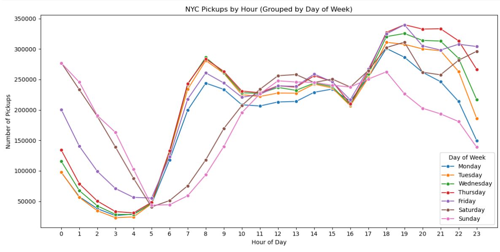
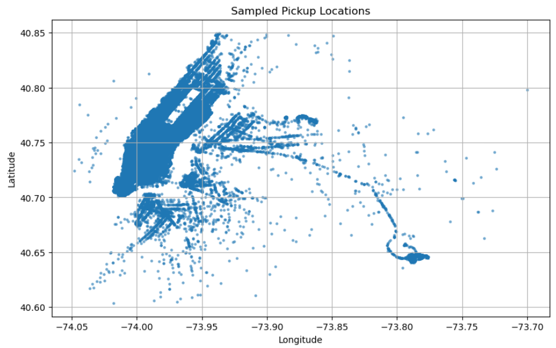
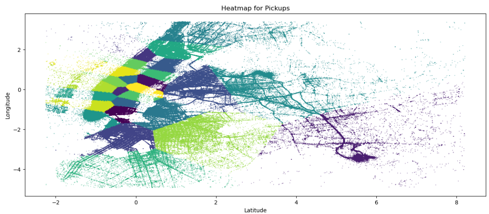

# Uber Ride Data Analysis & Forecasting 🚕📊

## Project Overview
This project analyzes large-scale Uber ride data to extract insights, preprocess complex datasets, and build predictive models. The dataset includes trip details like timestamps, distances, passenger counts, and geographic info, providing a real-world case for big data handling, feature engineering, and time series modeling.

An **interactive Streamlit app** was developed to visualize ride patterns, demand trends, and predictive outputs.

---
## Interactive Streamlit App
Explore ride patterns, demand trends, and predictive insights through the interactive app:  
[View the Streamlit App](YOUR_STREAMLIT_APP_LINK)
## Workflow

---

### 1. Data Collection & Integration
- Aggregated multiple months of `yellow_tripdata` CSV files into a unified DataFrame.
- Leveraged **Dask** for efficient large-scale data processing.

### 2. Data Cleaning & Preprocessing
- Removed irrelevant columns and handled missing values.
- Filtered anomalies such as unrealistic passenger counts, distances, durations, and out-of-bounds coordinates.
- Applied smoothing to reduce noise in continuous features.

### 3. Feature Engineering
- Extracted temporal features (day, month, weekday) and created lag features.
- One-hot encoded categorical variables and applied scaling for modeling.

### 4. Exploratory Data Analysis (EDA)
- Visualized distributions, correlations, and outliers.
- Analyzed passenger trends, ride distances, and geographic hotspots.
- Identified seasonal and temporal demand patterns.

### 5. Modeling & Forecasting
- Tested regression models to predict ride demand and trip duration.
- Tuned smoothing parameters and lag features for forecasting.
- Evaluated models using MSE and R²; **Linear Regression** performed best.

### 6. Evaluation & Insights
- Evaluated models on unseen data for generalizability.
- Derived insights on peak demand periods and ride behavior.
- Predictions can inform operational strategies for ride-sharing services.

---

## Tools & Technologies
- **Programming & Analysis:** Python, Pandas, NumPy
- **Big Data Processing:** Dask
- **Visualization:** Matplotlib, Seaborn
- **Web App:** Streamlit
- **Modeling & Forecasting:** scikit-learn, regression models

---

## Visualizations

### Day-wise Pickup Trends

### Sample Pickup Locations

### Heatmap of Clustered Pickup Locations

---

## Project Highlights
- End-to-end processing of multi-million row Uber ride datasets.
- Scalable data handling and preprocessing using Dask.
- Feature engineering tailored to temporal and spatial patterns.
- Robust EDA revealing trends and anomalies.
- Predictive modeling with actionable insights for operations.
- Interactive dashboard for visual exploration of data and forecasts.

---

## Conclusion
This project showcases the ability to handle large-scale datasets, extract meaningful patterns, and build scalable predictive solutions. The integration of a Streamlit app adds an interactive layer for real-time exploration and decision-making.
